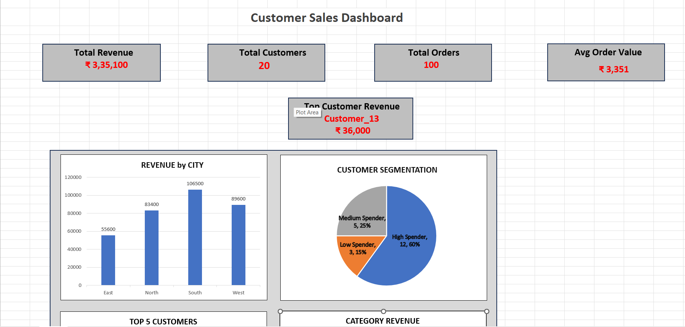
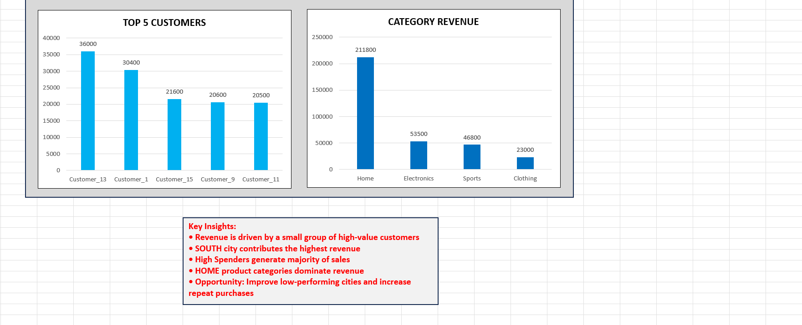

# 🛒 Customer Sales Analysis (SQL Project)

## 📌 Project Overview

This project analyzes customer purchasing behavior using SQL.
The goal is to identify high-value customers, understand sales trends, and generate actionable business insights to improve revenue and retention.

---

## 🎯 Project Objectives
- Analyze total sales and order patterns
- Identify top customers and revenue drivers
- Segment customers based on spending and frequency
- Find city-wise and product-wise performance
- Generate business insights for decision-making

---

## 📊 Dataset Description

The dataset consists of 3 tables:

* **customers** → customer details (name, city)
* **orders** → order transactions (quantity, product_id)
* **products** → product details (price, category)

---

## 🛠️ Tools & Technologies
- SQL (MySQL)
- MySQL Workbench
- Excel (for visualization)
- GitHub (project showcase)

---

## 🧠 Key SQL Concepts Used
- JOINs (LEFT JOIN)
- Aggregations (SUM, COUNT)
- GROUP BY & ORDER BY
- CASE WHEN (Segmentation)
- COALESCE
- Data Analysis Queries

---

## 📊 Key Business Questions Solved

1. Who are the top customers by revenue?
2. Which cities generate the highest sales?
3. Which product/category is most popular?
4. How to segment customers based on spending?
5. How to identify loyal vs inactive customers?

---

## 📸 Project Screenshots

### Top Customers by Revenue

### Customer Segmentation

### City-wise Sales

### Loyalty Segmentation

## 📈 Dashboard

---

## 📍 Revenue by City

### 💡 Insights:
- SOUTH is the highest revenue-generating city (~31.78%)
- EAST has the lowest sales → needs improvement
- Significant gap across cities → uneven market reach

---

## 👥 Customer Segmentation

### 💡 Insights:
- Majority customers fall in Low/Medium segment
- Indicates strong potential for upselling
- High-value customers should be retained carefully

---

## ⭐ Top Customers

### 💡 Insights:
- A small group of customers drives major revenue
- These customers should be treated as VIP segment
- Personalized offers can increase retention

---

## 🚀 Key Learnings
- Improved SQL query writing and optimization
- Learned how to convert raw data into business insights
- Understood customer segmentation techniques
- Built a complete end-to-end data analysis project

---

### 📈 Key Metrics (KPIs)
- Total Revenue: ₹ 3,35,100
- Total Orders: 100
- Total Customers: 20
- Average Order Value: ₹ 3,351
- Top Customer Revenue: ₹ 36,000

---

## 📌 Final Business Summary
- Revenue is driven by a small group of high-value customers
- Customer retention is a key growth opportunity
- Certain cities and product categories dominate sales
- Business should focus on:
  - Retaining high-value customers
  - Improving low-performing regions
  - Increasing repeat purchases
---

## 🚀 Future Improvements

* Add Power BI / Excel dashboard
* Perform cohort and retention analysis
* Automate reporting

---
