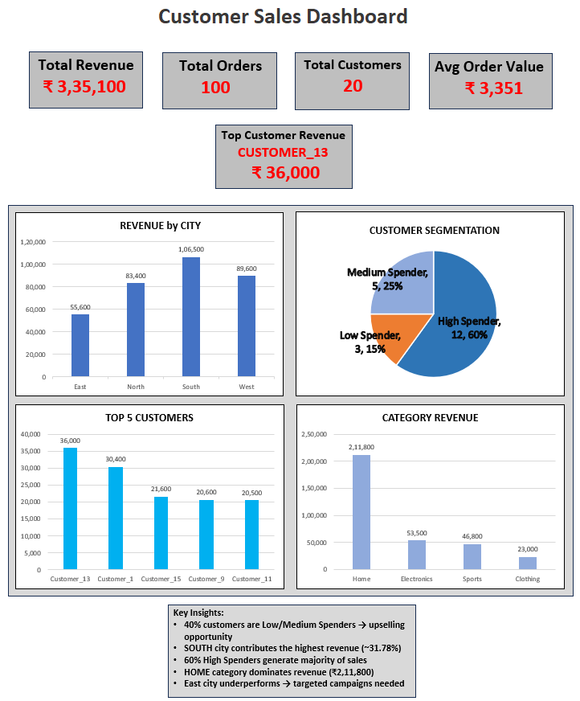

# 📊 SQL + Excel Customer Sales Dashboard

This project analyzes customer purchasing behavior using SQL and presents insights through an interactive Excel dashboard.

---

## 🎯 Business Problem

Businesses often struggle to identify:
- High-value customers
- Revenue-driving cities and products
- Customer retention opportunities

This project solves these problems using data analysis.

---

## 🛠️ Tools Used
- SQL (MySQL)
- MySQL Workbench
- Excel (Dashboard & Visualization)
- GitHub

---

## 📊 Dashboard Preview

  
   
  <em>Customer Sales Dashboard (Excel)</em>

---

## 📈 Key Performance Indicators (KPIs)

- 💰 **Total Revenue:** ₹ 3,35,100  
- 🛒 **Total Orders:** 100  
- 👥 **Total Customers:** 20  
- 📊 **Average Order Value:** ₹ 3,351  
- ⭐ **Top Customer Revenue:** ₹ 36,000  

---

## 🔍 Key Insights

### 📍 Revenue Insights
- SOUTH is the highest revenue city (~31.78% — ₹1,06,500)
- Home category dominates with ₹2,11,800 (63% of revenue)
- East city lowest at ₹55,600 → growth opportunity

### 👥 Customer Insights
- 60% High Spenders → strong premium customer base
- 85% Loyal customers → focus on new customer acquisition
- Top 5 customers contribute ₹1,29,100 of total revenue

### 🛍️ Product Insights
- Home category leads with ₹2,11,800 revenue
- Electronics second at ₹53,500
- Clothing lowest at ₹23,000 → upsell opportunity
  
---

## 🧠 SQL Analysis Highlights

This project includes:

- Customer Segmentation (CASE WHEN)
- Revenue Analysis (SUM, GROUP BY)
- Frequency Analysis (COUNT)
- City-wise & Product-wise Insights
- Business-driven SQL queries

---

## 📂 Project Structure
SQL-PROJECTS/
├── DashBoard.png                      
├── ecommerce_customer_analysis.sql    
└── README.md                         

---

## 🚀 Business Recommendations

- Focus on retaining high-value customers
- Improve performance in low-revenue cities
- Increase repeat purchases through engagement strategies
- Use top products for marketing and bundling

---

## 🔮 Future Improvements

- Build interactive dashboard in Power BI
- Add cohort and retention analysis
- Automate reporting pipeline

---
